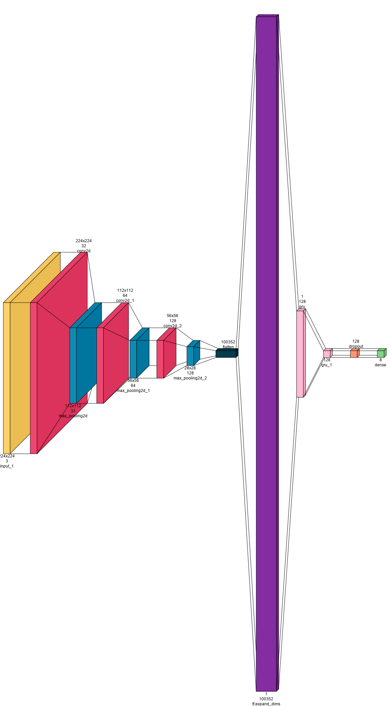
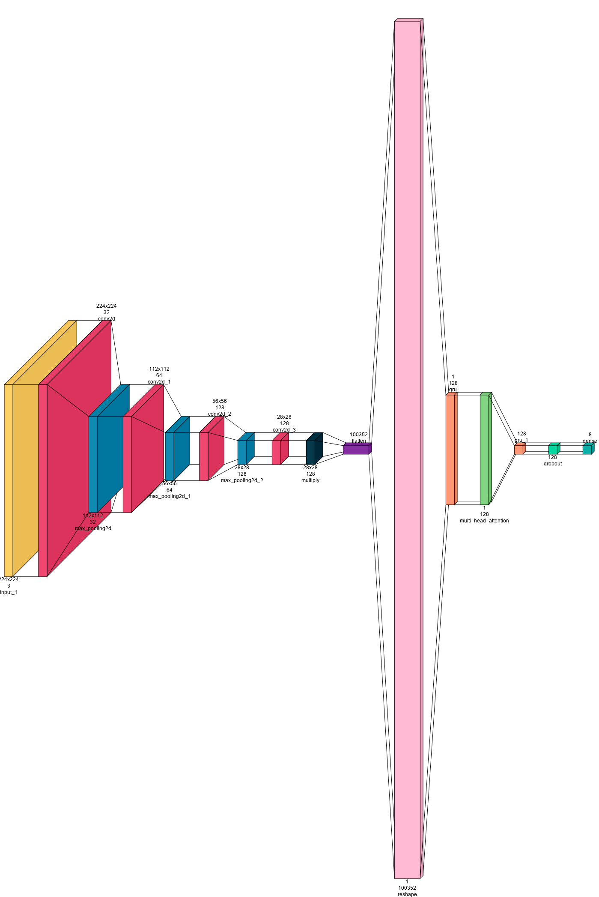
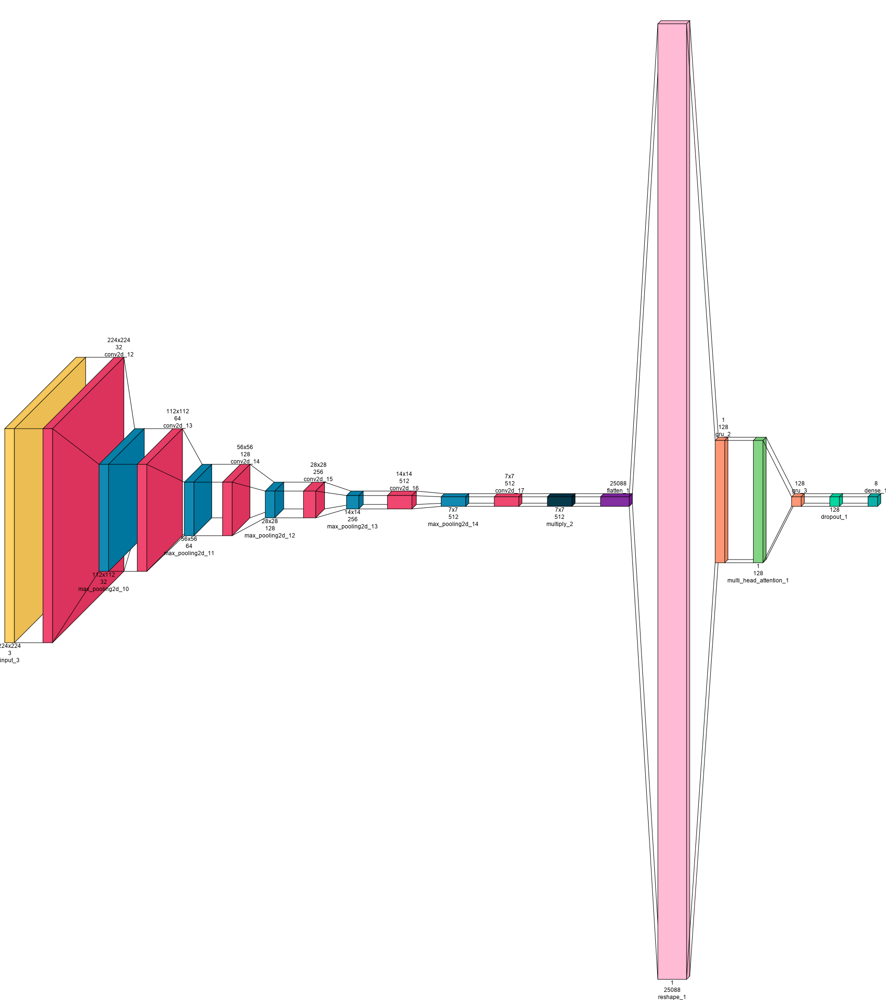

# Dental Anomalies Detection in Maxillary and Mandibular Aspect of Teeth using CNN-GRU Models and Local Model Agnostic Explanations

The academic study titled "Dental Anomalies Detection in Maxillary and Mandibular Aspect of Teeth using CNN-GRU Models and Local Model Agnostic Explanations" presents the development and implementation of three distinct models. These models aim to accurately detect dental anomalies in both the maxillary and mandibular aspects of teeth by leveraging the capabilities of CNN-GRU architecture. Additionally, the study emphasizes the importance of interpretability and transparency in AI models, incorporating Local Model Agnostic Explanations (LIME) to provide clear insights into the decision-making processes of the developed models.

## Real dental image dataset

| Class         | Train set | Test set | ∑     | Description |
|---------------|-----------|----------|-------|-------------|
| Lower Front   | 754       | 172      | 926   | Covers all the labial and buccal surfaces of the mandibular central incisors to canines on both the right and left sides. |
| Upper Front   | 885       | 190      | 1,075 | Covers all the labial and buccal surfaces of the maxillary central incisors to canines on both the right and left sides. |
| Lower Left    | 1,270     | 296      | 1,566 | Covers all the labial and buccal surfaces from the distal half of the mandibular right canine to the last erupted tooth on the right side. |
| Upper Left    | 1,028     | 261      | 1,289 | Covers all the labial and buccal surfaces from the distal half of the maxillary left canine to the last erupted tooth on the left side of the maxillary arch. |
| Lower Occlusal| 845       | 177      | 1,022 | Covers the occlusal and incisal surfaces of all the teeth in the mandibular arch. |
| Upper Occlusal| 892       | 248      | 1,140 | Covers the occlusal and incisal surfaces of all the teeth in the maxillary arch. |
| Lower Right   | 1,086     | 315      | 1,401 | Covers all the labial and buccal surfaces from the distal half of the mandibular right canine to the last erupted tooth on the right side of the mandibular arch. |
| Upper Right   | 890       | 253      | 1,143 | Covers all the labial and buccal surfaces from the distal half of the maxillary right canine to the last erupted tooth on the right side of the maxillary arch. |
| ∑             | 7,650     | 1,912    | 9,562 | The dataset was split into training and test sets in an 8:2 ratio. |

**Original Dataset**

Chaudhary, S., Shah, P., Paygude, P., Chiwhane, S., Mahajan, P., Chavan, P., & Kasar, M. (2024). Varying views of maxillary and mandibular aspects of teeth: A dataset. Data in Brief, 56, 110772. https://doi.org/https://doi.org/10.1016/j.dib.2024.110772

## Models
*Model-1: CNN-GRU*

The CNN-GRU model integrates Convolutional Neural Networks (CNN) and Gated Recurrent Units (GRU) to enhance feature extraction and sequential data processing. The CNN layers extract hierarchical spatial features from input images, while the GRU layers capture temporal dependencies and contextual information. This hybrid architecture enables the model to effectively analyze complex patterns in dental images, making it suitable for detecting anomalies in maxillary and mandibular aspects of teeth. The model also incorporates local and global attention mechanisms to focus on critical areas, further improving diagnostic accuracy and performance.

*Model-2: CNN-GRU-LGA*

The CNN-GRU-LGA model enhances the CNN-GRU architecture by integrating Local and Global Attention (LGA) mechanisms. The CNN layers extract detailed spatial features from dental images, while the GRU layers handle temporal dependencies. Local attention mechanisms focus on specific regions within the images to highlight critical features, and global attention mechanisms capture broader context, improving overall feature relevance. This combination allows the model to achieve higher accuracy in detecting dental anomalies. By refining feature extraction and focusing on significant areas, the CNN-GRU-LGA model significantly improves diagnostic performance in analyzing maxillary and mandibular aspects of teeth.

*Model-3: Optimized CNN-GRU*

The Optimized CNN-GRU model further refines the CNN-GRU architecture by using Particle Swarm Optimization (PSO) to determine the optimal number of convolutional layers. This model combines CNN layers for extracting intricate spatial features with GRU layers for managing temporal dependencies. The integration of local and global attention mechanisms ensures focused and context-aware feature extraction. The optimization process enhances the model's accuracy, sensitivity, and specificity, making it highly effective for detecting dental anomalies in maxillary and mandibular aspects. This optimized approach achieves superior performance, demonstrating significant improvements in diagnostic accuracy and robustness over traditional methods.

